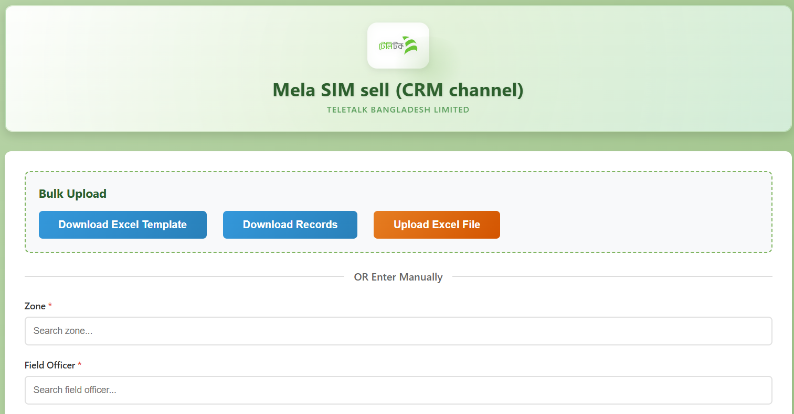

# Mela SIM Sell Portal (CRM Channel)



A comprehensive web-based data entry and management portal for Teletalk Bangladesh's Mela SIM sell operations through CRM channels. Features real-time validation, bulk Excel upload, searchable dropdowns, and seamless Oracle database integration.

## 🎯 Project Overview

The Mela SIM Sell Portal streamlines the process of recording and managing SIM card sales data for Teletalk Bangladesh. Built with Flask backend and vanilla JavaScript frontend, it provides both manual entry and bulk upload capabilities with extensive validation and error handling.

## ✨ Key Features

### Data Entry & Validation
- ✅ **Searchable Dropdowns**: Zone and Field Officer selection with real-time search functionality
- ✅ **Smart Validation**: 10-digit MSISDN starting with "15", date format validation (YYYY-MM-DD)
- ✅ **Duplicate Detection**: Real-time MSISDN duplicate checking before submission
- ✅ **Mutual Exclusion**: Automatic toggle between New SIM and Replace options
- ✅ **Date Entry**: Flexible date input with support for multiple formats

### Bulk Operations
- ✅ **Excel Template Download**: Pre-formatted template with proper column headers
- ✅ **Bulk Upload**: Upload multiple records via Excel file (.xlsx, .xls)
- ✅ **Auto Format Conversion**: Supports multiple date formats (YYYY-MM-DD, DD/MM/YYYY, etc.)
- ✅ **Error Reporting**: Detailed error messages with row numbers for failed uploads
- ✅ **Success Popup**: Beautiful notification showing upload results

### Data Management
- ✅ **Recent Submissions**: View latest 5 records in real-time
- ✅ **Excel Export**: Download all records as Excel file with timestamp
- ✅ **Oracle Integration**: Direct connection to Oracle 19c database (dwhdb02)
- ✅ **RESTful API**: Clean, documented API endpoints

### User Experience
- ✅ **Responsive Design**: Works perfectly on desktop, tablet, and mobile
- ✅ **Green Theme**: Professional Teletalk-branded color scheme
- ✅ **Real-time Feedback**: Instant validation messages and warnings
- ✅ **Auto-refresh**: Records table updates after submissions

## Project Structure

```
Table Insert Portal/
├── app.py                      # Flask backend application
├── config.py                   # Configuration settings
├── requirements.txt            # Python dependencies
├── .env.example               # Environment variables template
├── database/
│   ├── create_table.sql       # Oracle table creation script
│   └── deploy_table.sh        # Bash script to deploy table
├── static/
│   ├── index.html            # Main HTML page
│   ├── styles.css            # CSS styling
│   └── script.js             # Frontend JavaScript
├── logs/                      # Application logs (auto-created)
└── teletalk-logo.png         # Teletalk logo
```

## Prerequisites

- Python 3.8 or higher
- Oracle 19c Database access
- Oracle Instant Client 19.x (for cx_Oracle)
- Access to dwhdb02 database server

## Installation

### 1. Clone or Download the Project

```bash
cd "g:\Projects for Git\Table Insert Portal"
```

### 2. Install Oracle Instant Client

Download Oracle Instant Client from Oracle website and install it. Note the installation path.

### 3. Set Environment Variables

On Windows (PowerShell):
```powershell
$env:PATH += ";C:\path\to\instantclient_19_x"
```

On Linux:
```bash
export LD_LIBRARY_PATH=/path/to/instantclient_19_x:$LD_LIBRARY_PATH
```

### 4. Install Python Dependencies

```bash
pip install -r requirements.txt
```

### 5. Configure Environment

Copy `.env.example` to `.env` and update with your credentials:
```bash
cp .env.example .env
```

Edit `.env` with your actual database credentials.

### 6. Create Database Table

**Option A: Using SQLPlus on the server**

```bash
# SSH to dwhnode02
ssh dwhadmin@dwhnode02

# Run the deployment script
chmod +x database/deploy_table.sh
./database/deploy_table.sh
```

**Option B: Using SQL client**

Run the SQL script `database/create_table.sql` directly in your SQL client connected to dwhdb02.

## Running the Application

### Development Mode

```bash
python app.py
```

The application will be available at: `http://localhost:5000`

### Production Mode (with Gunicorn)

```bash
gunicorn -w 4 -b 0.0.0.0:5000 app:app
```

### Running as a Service (Linux)

Create a systemd service file `/etc/systemd/system/mela-sim-portal.service`:

```ini
[Unit]
Description=Mela SIM Sell Portal
After=network.target

[Service]
User=dwhadmin
WorkingDirectory=/home/dwhadmin/mela_sim_portal
Environment="PATH=/data01/app/oracle/product/19.0.0/dbhome_1/bin:/usr/local/bin:/usr/bin"
Environment="ORACLE_HOME=/data01/app/oracle/product/19.0.0/dbhome_1"
Environment="LD_LIBRARY_PATH=/data01/app/oracle/product/19.0.0/dbhome_1/lib"
ExecStart=/usr/bin/python3 /home/dwhadmin/mela_sim_portal/app.py
Restart=always

[Install]
WantedBy=multi-user.target
```

Enable and start the service:
```bash
sudo systemctl enable mela-sim-portal
sudo systemctl start mela-sim-portal
sudo systemctl status mela-sim-portal
```

## API Endpoints

### GET `/api/zones`
Get distinct zones for dropdown.

**Response:**
```json
{
  "success": true,
  "data": ["Zone1", "Zone2", ...]
}
```

### GET `/api/field-officers`
Get distinct field officers for dropdown.

**Response:**
```json
{
  "success": true,
  "data": ["Officer1", "Officer2", ...]
}
```

### POST `/api/submit`
Submit new SIM sell record.

**Request Body:**
```json
{
  "zone": "Zone Name",
  "field_officer": "Officer Name",
  "btsid": "BTS123",
  "msisdn": "1234567890",
  "new_sim": "YES",
  "replace": "NO",
  "new_retailer_count": 5
}
```

**Response:**
```json
{
  "success": true,
  "message": "Data submitted successfully"
}
```

### GET `/api/records?limit=50`
Get recent records.

**Response:**
```json
{
  "success": true,
  "data": [
    {
      "ID": 1,
      "ZONE": "Zone1",
      "FIELD_OFFICER": "Officer1",
      ...
    }
  ]
}
```

### GET `/health`
Health check endpoint to verify database connectivity.

## Database Schema

**Table:** `Mela_SIM_sell_crm_cnl_T`

| Column | Type | Description |
|--------|------|-------------|
| ID | NUMBER | Auto-increment primary key |
| ZONE | VARCHAR2(100) | Zone name (required) |
| FIELD_OFFICER | VARCHAR2(200) | Field officer name (required) |
| BTSID | VARCHAR2(100) | BTS ID (required) |
| MSISDN | VARCHAR2(10) | 10-digit mobile number (required) |
| NEW_SIM | VARCHAR2(3) | YES or NO (required) |
| REPLACE_SIM | VARCHAR2(3) | YES or NO (required) |
| NEW_RETAILER_COUNT | NUMBER(2) | 0-99 (required) |
| CREATED_DATE | TIMESTAMP | Auto-generated timestamp |
| CREATED_BY | VARCHAR2(100) | User who created record |

## Loading Reference Data

To populate the Zone and Field Officer dropdowns, you have two options:

### Option 1: Load from CSV
If you have a CSV file with existing data, create a Python script to load it:

```python
import csv
import cx_Oracle

# Read CSV and insert unique zones/officers
# This is a one-time operation
```

### Option 2: Populate from Existing Records
Once you start entering data, the dropdowns will automatically populate with distinct values from the database.

## Troubleshooting

### Oracle Connection Issues

1. **DPI-1047: Cannot locate Oracle Client library**
   - Ensure Oracle Instant Client is installed
   - Set LD_LIBRARY_PATH (Linux) or PATH (Windows) correctly

2. **ORA-12154: TNS:could not resolve the connect identifier**
   - Check tnsnames.ora configuration
   - Verify DB_DSN in config matches your TNS entry

3. **ORA-01017: invalid username/password**
   - Verify credentials in .env file
   - Test connection using sqlplus

### Application Issues

1. **Port 5000 already in use**
   - Change port in app.py or config.py
   - Kill existing process: `lsof -ti:5000 | xargs kill -9`

2. **CORS errors**
   - Check CORS configuration in app.py
   - Ensure frontend is served from correct origin

## Security Notes

- **Never commit `.env` file** to version control
- Change default database password in production
- Use HTTPS in production environment
- Implement user authentication if needed
- Restrict CORS origins in production

## Development Team

- **Developer**: Opus Technology Limited
- **Database**: Oracle 19c (dwhdb02)
- **Server**: dwhnode02

## License

Proprietary - Teletalk Bangladesh Limited

## Support

For issues or questions, contact the development team.
